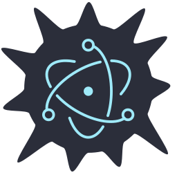

# OpenBSD + Electron

    

An effort to port electron (and thus VScode) on OpenBSD.
It comes with customs modnpm and modyarn modules.

Status : Working, need some more cleaning.

## Main app 

* VScode : everythings seems to works
* teams-for-linux : screen share, webcam, audio tested ok
* signal-desktop : screen share, webcam, audio tested ok
* stretchly
